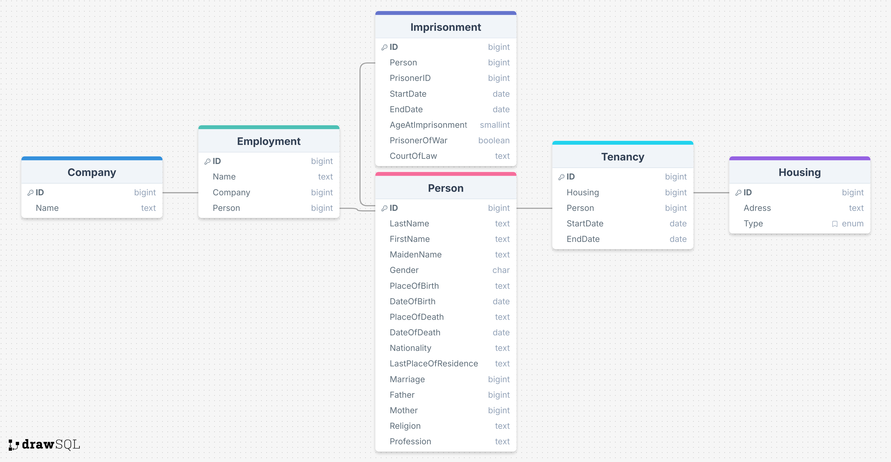

## Visualization of the International Dimension of Forced Labour in Nazi Germany
This is a Python/Flask app listening on port TCP/5000.  
All terminal commands are run from project root directory unless stated otherwise.  

## Config
Create a Python Virtual Environment using Python >=3.12.  
Use the recommended extensions from `.vscode/extensions.json` if you use VSCode.  
Install dependencies: `pip install -r requirements.txt`  
Add new module dependencies: `pip freeze > requirements.txt`  
[Create a local MySQL database for development](https://dev.mysql.com/doc/mysql-getting-started/en/). Store credentials in the .env schema shown below.  

## Run Flask
Run with `flask --app app/main.py run`  
Debug mode with `flask --app app/main.py run --debug`  
Open with: [http://127.0.0.1:5000](http://127.0.0.1:5000)  
Debug mode enables on-the-fly changes to the app as well as additional logging statements through Flask.logger.info().  

## Containerization
Install Docker and docker-compose.  
Current containerization supports a MySQL (MariaDB) database on TCP/3306 as well as the Flask app on TCP/5000 and the Cockpit headless CMS on TCP/8080.  
Create container: `docker compose up --build`  
Run container: `docker compose up -d`  
Remove container: `docker compose down`  


## Dotenv Schema
Create these files and fill them with data.  
### .env
```
SQL_USER=
SQL_PASSWORD=
SQL_DB=
SQL_HOST=
```
If MySQL is run from Docker container: `SQL_HOST=db`.

## MySQL Schema

It is possible to fill the DB with real data through the `excel_migration.py` script. Note that this is still very WIP and due to change. Some features are still missing.  
Run data migration: `python excel_migration.py`  
Ensure MySQL is connected and .env has data.
### Person
```
CREATE TABLE IF NOT EXISTS `Person` (
    `ID` int(11) NOT NULL AUTO_INCREMENT,

    `LastName` varchar(255) NOT NULL,
    `FirstName` varchar(255) NOT NULL,
    `MaidenName` varchar(255),
    `Gender` enum('M', 'F', 'X') NOT NULL,

    `PlaceOfBirth` varchar(255),
    `DateOfBirth` date,
    `PlaceOfDeath` varchar(255),
    `DateOfDeath` date,
    `Nationality` varchar(255),
    `LastPlaceOfResidence` varchar(255),

    `Marriage` varchar(255),
    `Father` varchar(255),
    `Mother` varchar(255),
    `Religion` varchar(255),
    `Profession` varchar(255),

    PRIMARY KEY (`ID`)
    ) ENGINE=InnoDB
```

### Employment
```
CREATE TABLE IF NOT EXISTS `Employment` (
    `ID` int(11) NOT NULL AUTO_INCREMENT,
    `Name` varchar(255),
    `Company` int(11) NOT NULL,
    `Person` int(11) NOT NULL,

    PRIMARY KEY (`ID`),
    FOREIGN KEY (`Person`) REFERENCES `Person`(`ID`),
    FOREIGN KEY (`Company`) REFERENCES `Company`(`ID`)
    ) Engine=InnoDB
```

### Company
```
CREATE TABLE IF NOT EXISTS `Company` (
    `ID` int(11) NOT NULL AUTO_INCREMENT,
    `Name` varchar(255) NOT NULL,

    PRIMARY KEY (`ID`)
    ) Engine=InnoDB
```

### Housing
```
CREATE TABLE IF NOT EXISTS `Housing` (
    `ID` int(11) NOT NULL AUTO_INCREMENT,
    `Adress` varchar(255) NOT NULL,
    `Type` enum('Schwenningen', 'Imprisonment', 'Living') NOT NULL,

    PRIMARY KEY (`ID`)
    ) Engine=InnoDB
```

### Tenancy
```
CREATE TABLE IF NOT EXISTS `Tenancy` (
    `ID` int(11) NOT NULL AUTO_INCREMENT,
    `Housing` int(11) NOT NULL,
    `Person` int(11) NOT NULL,
    `StartDate` date,
    `EndDate` date,

    PRIMARY KEY (`ID`),
    FOREIGN KEY (`Housing`) REFERENCES `Housing`(`ID`),
    FOREIGN KEY (`Person`) REFERENCES `Person`(`ID`)
    ) Engine=InnoDB
```

### Imprisonment
```
CREATE TABLE IF NOT EXISTS `Imprisonment` (
    `ID` int(11) NOT NULL AUTO_INCREMENT,
    `PrisonerID` int(11),
    `StartDate` date,
    `EndDate` date,
    `AgeAtImprisonment` int(11),
    `PrisonerOfWar` bool,
    `CourtOfLaw` varchar(255),

    PRIMARY KEY (`ID`),
    FOREIGN KEY (`Person`) REFERENCES `Person`(`ID`)
    ) Engine=InnoDB
```

## OpenStreetMap & OpenHistoricalMap
OpenStreetMap & OpenHistoricalMap have a public API.  
This project uses the [OSMnx Python library](https://osmnx.readthedocs.io/en/stable/getting-started.html).  
As of right now, it is possible to render a high-resolution PNG image of a chosen city's roads from OSM within the Flask app.  
It is also possible to query for interactive OSM maps.  
[Note that OpenHistoricalMap's API differs slightly from that of OpenStreetMap.](https://wiki.openstreetmap.org/wiki/OpenHistoricalMap/Overpass) Certain queries need to be modified.

## Sources
### OSM / OHM
[OpenStreetMap Doc: Elements](https://wiki.openstreetmap.org/wiki/Elements)  

### Flask
[Primer on Jinja Templating](https://realpython.com/primer-on-jinja-templating/)  
[GET Request Query Parameters with Flask](https://www.geeksforgeeks.org/python/get-request-query-parameters-with-flask/)  
[Python Docker image documentation](https://hub.docker.com/_/python/)  

### OSMnx / Folium
Boeing, G. (2025). [Modeling and Analyzing Urban Networks and Amenities with OSMnx.](https://doi.org/10.1111/gean.70009) Geographical Analysis 57 (4), 567-577. doi:10.1111/gean.70009  
[Creating beautiful maps with Python](https://towardsdatascience.com/creating-beautiful-maps-with-python-6e1aae54c55c/)  
[How to Create Interactive Maps with GeoPandas’ explore() Method](https://www.statology.org/how-to-create-interactive-maps-with-geopandas-explore-method/)  
[OSMnx PDF](https://osmnx.readthedocs.io/_/downloads/en/stable/pdf/)  
[Leaflet Provider Demos](https://leaflet-extras.github.io/leaflet-providers/preview/)  
[Beginner’s Guide to Folium: Your First Interactive Map with Python](https://archive.is/20251013175725/https://cityplannermo.medium.com/beginners-guide-your-first-interactive-map-with-python-folium-8f1c2ec20155#selection-811.18-831.11)  
[Customizing Your Folium Maps: Tiles, Zoom, and Popups for Urban Analysis](https://archive.is/20250822085542/https://cityplannermo.medium.com/customizing-your-folium-maps-tiles-zoom-and-popups-for-urban-analysis-284e59d813ae)

### MySQL
[MySQL doc](https://dev.mysql.com/doc/connector-python/en/connector-python-example-ddl.html)  
[Understanding Connection Pooling for MySQL](https://medium.com/@havus.it/understanding-connection-pooling-for-mysql-28be6c9e2dc0)  


