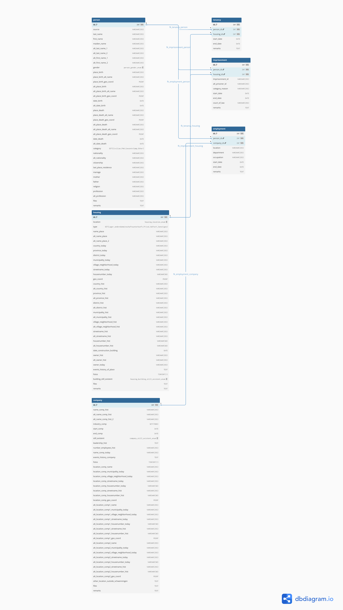

## Excel-Migration
To run the script, one needs to have Directus running on port 8055 and MySQL as defined by the dotenv (use docker-compose to quickly do this).  
The script directly creates and writes Directus collections without using MySQL as a middleman.  
VENV requirements are specified within `backend/`.

### MySQL Cheatsheet

```
docker exec -it visualisierung-ns-zwangsarbeit-mysql-1
USE ${MYSQL_DATABASE};
SELECT * FROM ${TABLE};
```

## Sources
[How to filter the Directus API](https://learndirectus.com/how-to-filter-the-directus-api/)  
[Application Factories](https://flask.palletsprojects.com/en/stable/patterns/appfactories/)